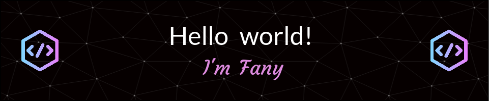

  😍 I’m a **Front-end web development Jr.** 
  🏠 I’m living in **Mexico City** 
  👨‍💻 See my portafolio at [http://resume-umber-three.vercel.app/](http://resume-umber-three.vercel.app/) 
  🌱 I’m currently learning about **HTTP requests in JavaScript** 
  🌱 I’m currently learning **React**

<h3 align="left">You can connect with me:</h3>
    
 alvarezpestefania@outlook.com

    
 estefanía priscila alvarez palma

  

   <h3>Languages and Tools:</h3> 
     
     
    
     
     
     
     
     
       
  

   

  
   
  

